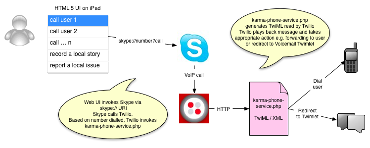

# Karma Phone

## Overview

**Karma Phone** was built as part of the OpenIDEO <http://openideo.com> Make-athon #ideomake on Feb 17-18 2012

The original brief was that of Postcode Gangs - how could we build something to develop and improve community facilities within a postcode area within London?

The idea of the prototype is to foster local community by providing a hyperlocal skills swap and information service.

### Requirements

This is a web app designed to be used on an iPad or other tablet device (the web UI is sized appropriately for an iPad but it would be trivial to modify for another device). 

The backend needs a web server which can serve PHP.

The application relies on the use of Twilio <http://twilio.com> APIs and TwiML, and also uses a Twimlet <http://twimlets.com> as a quick route to voicemail functionality. A Twilio account is required to setup the numbers and routing of calls.

Due to limitations on the ability of an iPad to run the Twilio web client (which uses Flash), the workaround here is to use the Skype URI scheme `skype://number?call` to launch the Skype client on the device. This therefore obviously also requires Skype to be installed and an account with credit to login (since you will end up dialling real numbers not VoIP IDs).

Another limitation is that this cannot be installed and launched from the iPad Launcher as a web app because this prevents the ability to launch the Skype app (it works when loaded normally using Safari, or from a bookmark).

### Technical Overview

The visitor to the Karma Phone "booth" selects from a menu of available people to talk to, or chooses to record a message.

The web page asks Skype to place a call to a number which is in fact provided by Twilio.

Twilio maps the number to a URL - in this case `karma-phone-service.php?name=xxx`

The PHP script generates TwiML (Twilio's markup language) which tells Twilio what to playback to the user, and then either forwards the call to a real person, or pushes the call to a voicemail box implemented in a simple Twimlet.

### Setup

Edit `karma-phone-service.php` to add valid passthrough numbers for the users to be called, and to amend the email address used by the voicemail Twimlet for messages. Edit `index.html` and change the `skype://` links to point to the Twilio numbers.

Install the Karma Phone web app to a publically-visible web server with PHP support.

On the Twilio user dashboard, edit the list of phone numbers and for each one, set the Voice target URL to be the real online location of `karma-phone-service.php?name=user-to-be-called`

Point the iPad at the web server.

Optionally, add the Karma Phone bookmark to the iPad launcher by selecting Bookmark button -> add to Home Screen.

For best results in the real world, use a handset such as a Moshi Moshi Retro handset <http://amzn.to/A1yeeL>

The user can now select from the menu of users or services, and Skype will be launched to call the backend.

* a "real user" will be called via a redirection from the Twilio number to their registered number (this way, we can add additional voice prompts, and also disintermediate the real number such that an individual's personal contact information is never shared directly)
* one of the recording options (leave a story/report a problem) will redirect to a simple voicemail box which will email the audio and transcript to a user identified in the code

### The Team that created Karma Phone

Huge thanks to:

* Tim Burrell-Saward @tburrellsaward
* Victoria Brooks @vbrooksy
* Lydia Howland @lydiahowland
* Steve O'Connor
* Andy Piper @andypiper
* Hayley Stopford @HayleyS
* Dan Watson @DNW1710
* James from Sugru

### Future Enhancement Ideas

* perform real-world user testing - how will real people respond to the idea of an "open" phone in the middle of a postcode area?
* fix to enable web-to-phone calls (may require Twilio to release an HTML 5 web client instead of Flash)
* put userid/phone numbers into a proper database and build UI to enable new users to register the knowledge they have to share
* instead of using voicemail Twimlet, build a proper voicemail box with the Twilio API
* add additional information to the front-end including e.g. realtime data from local sources (traffic, weather, pollution, crime etc)
* improve UI with better fonts, cached images in CSS, etc
